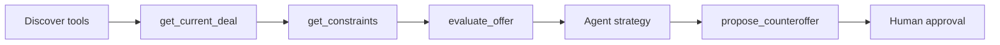

# WebMCP Workflow Contract

All agent-facing deal operations use discoverable WebMCP tools and emit a visible Agent Activity Event.

| Tool | Input | Result |
|------|-------|--------|
| `get_current_deal` | `deal_id` | Current terms, targets, and approval state |
| `get_constraints` | `deal_id` | Constraints with severity and limits |
| `evaluate_offer` | `deal_id`, complete candidate terms | Deterministic score, feasibility, failures, trade-offs |
| `propose_counteroffer` | `deal_id`, terms, rationale, evaluation reference | Pending human-approval proposal |
| `inspect_ui_schema` | Published schema id | Published version and layout |
| `preview_ui_mutation` | Base version, presentation patch | Preview and validation outcome |
| `publish_ui_mutation` | Reviewed mutation id | New published schema version |

## Rules

- Identical evaluation input returns identical score and hard failures.
- A hard failure makes an alternative infeasible, regardless of price.
- Agent proposals never auto-apply and incomplete proposals are invalid.
- Schema patches targeting deal terms, constraints, evaluator behavior, or approval state are rejected.

## React Flow DAG

The schema-rendered React Flow node uses these selectable directed nodes. Activity events update node state; selected nodes reveal request id, timestamp, input summary, and result summary. It is a live explanation of a run, not a workflow editor.